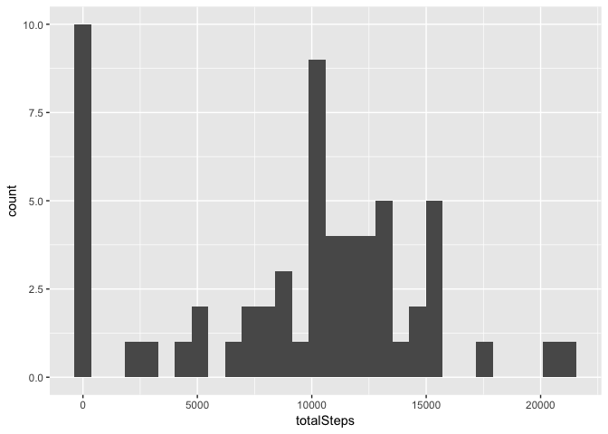
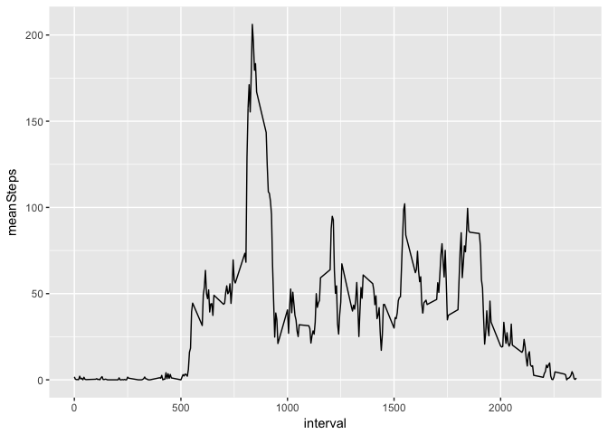
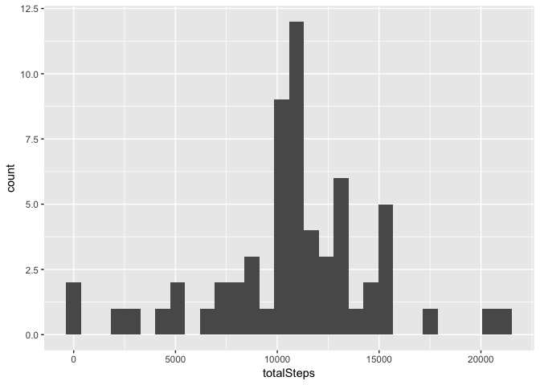
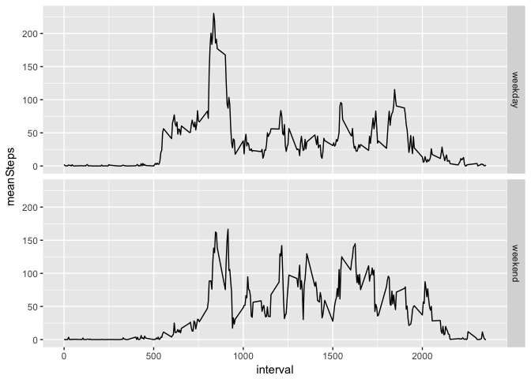

# Reproducible Research: Peer Assessment 1


## Loading and preprocessing the data


```r
workDir = "/Users/gralspaugh/Google Drive/Coursera/Data Science Specialization/coursera_repo/reproducible_research/courseProject1"
if(!file.exists(workDir))
{dir.create(workDir)}

dataURL <- "https://d396qusza40orc.cloudfront.net/repdata%2Fdata%2Factivity.zip"
dataZIP <- paste(workDir, "activities.zip", sep = "/")
download.file(dataURL, dataZIP)
dataConn <- unz(dataZIP, "activity.csv")
data <- read.csv(dataConn)
```
## What is mean total number of steps taken per day?

```r
library(dplyr)
```

```
## 
## Attaching package: 'dplyr'
```

```
## The following objects are masked from 'package:stats':
## 
##     filter, lag
```

```
## The following objects are masked from 'package:base':
## 
##     intersect, setdiff, setequal, union
```

```r
library(ggplot2)
groupByDay <- group_by(data, date)
totalStepsFrame <- summarize(groupByDay, totalSteps = sum(steps, na.rm = TRUE))

histSteps <- qplot(totalSteps, data = totalStepsFrame)
histSteps
```

```
## `stat_bin()` using `bins = 30`. Pick better value with `binwidth`.
```

<!-- -->

```r
meanSPD <- mean(totalStepsFrame$totalSteps)
medSPD <- median(totalStepsFrame$totalSteps)
meanSPD
```

```
## [1] 9354.23
```

```r
medSPD
```

```
## [1] 10395
```


## What is the average daily activity pattern?


```r
groupByInt <- group_by(data, interval)
meanStepsFrame <- summarize(groupByInt, meanSteps = mean(steps, na.rm = TRUE))
timeSeries <- qplot(interval, meanSteps, data = meanStepsFrame, geom = "line")
timeSeries
```

<!-- -->

```r
maxMeanSteps <- max(meanStepsFrame$meanSteps)
intMax <- meanStepsFrame[meanStepsFrame$meanSteps == maxMeanSteps,]
intMax
```

```
## # A tibble: 1 x 2
##   interval meanSteps
##      <int>     <dbl>
## 1      835  206.1698
```

## Imputing missing values

```r
totalNAs <- sum(is.na(data))
totalNAs
```

```
## [1] 2304
```

```r
# copyData <- data
# INT <- data$interval[1]
# INTmatch <- meanStepsFrame[meanStepsFrame$interval == INT,]
# meanRep <- INTmatch$meanSteps
# data$steps[1] <- meanRep
noNAsData <- data
for(i in 1:nrow(noNAsData)) {
        if(is.na(noNAsData$steps[i])==TRUE) {
                INT <- noNAsData$interval[i]
                INTmatch <- meanStepsFrame[meanStepsFrame$interval == INT,]
                meanRep <- INTmatch$meanSteps
                noNAsData$steps[i] <- meanRep
        }
}
groupByDay2 <- group_by(noNAsData, date)
totalStepsFrame2 <- summarize(groupByDay2, totalSteps = sum(steps))

histSteps2 <- qplot(totalSteps, data = totalStepsFrame2)
histSteps2
```

```
## `stat_bin()` using `bins = 30`. Pick better value with `binwidth`.
```

<!-- -->

```r
meanSPD2 <- mean(totalStepsFrame2$totalSteps)
medSPD2 <- median(totalStepsFrame2$totalSteps)
meanSPD2
```

```
## [1] 10766.19
```

```r
medSPD2
```

```
## [1] 10766.19
```

## Are there differences in activity patterns between weekdays and weekends?


```r
weekendData <- noNAsData
weekendDataEdit <- mutate(weekendData, weekday = weekdays(as.Date(date)))
for(i in 1:nrow(weekendDataEdit)) {
        if(weekendDataEdit$weekday[i] == "Saturday" | weekendDataEdit$weekday[i] == "Sunday"){
                weekendDataEdit$weekday[i] <- "weekend"
        }
        else {
                weekendDataEdit$weekday[i] <- "weekday"
        }
}
weekendDataEdit <- mutate(weekendDataEdit, weekday = as.factor(weekday))
groupByInt2 <- group_by(weekendDataEdit, interval, weekday)
timeSeriesFrame <- summarize(groupByInt2, meanSteps = mean(steps))
qplot(interval, meanSteps, data = timeSeriesFrame, facets = weekday ~ ., geom = "line")
```

<!-- -->
